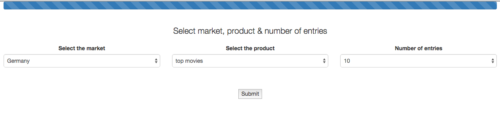

iTunes Scraper
==============

Brief
-----

Write an application to download the charts from the iTunes [RSS Feed Generator](https://rss.itunes.apple.com/gb) as a csv file.

Frameworks and languages used
-----

* Production - Javascript, Express, basic Bootstrap, HTML
* Test - currently not tested as it was developed prior to learning any test framework

App
-----

The app is available [here](http://malomd.herokuapp.com/)

